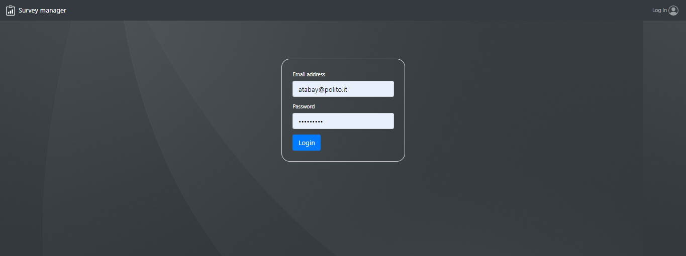
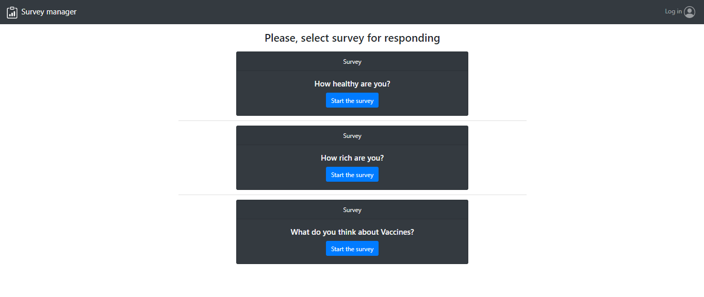
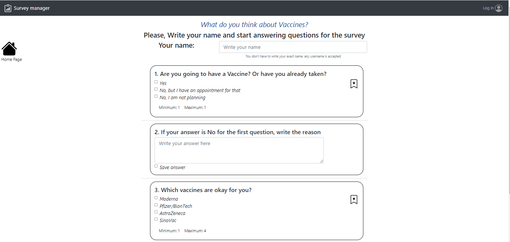
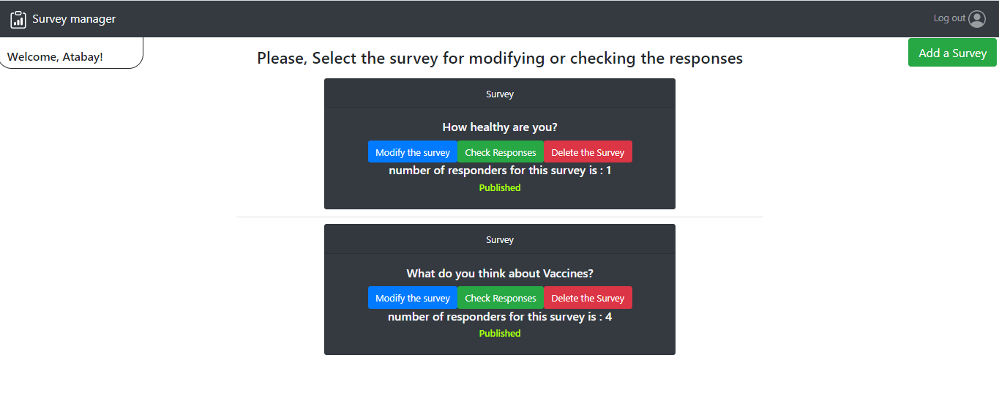
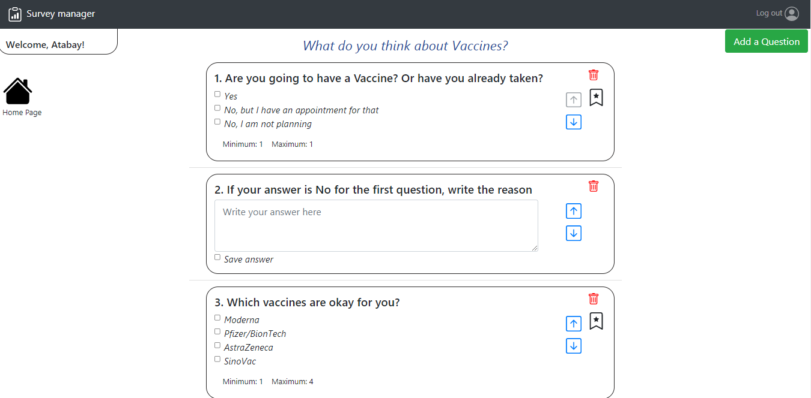
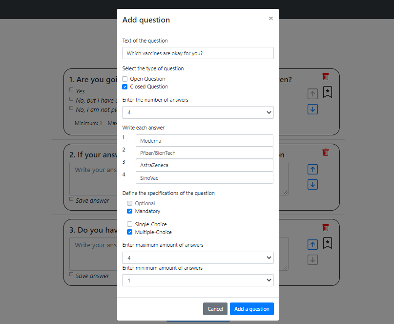
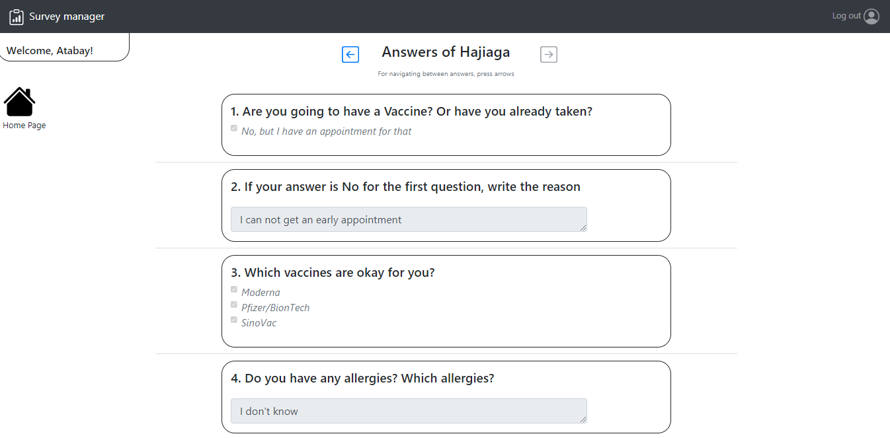

# Exam #1: "Survey"

## Student: s277000 HEYDARLI ATABAY

## React Client Application Routes

- Route `/`: redirects to the "/surveys" route
- Route `/login`: Login page where administrators can authenticate itself
- Route `/surveys`: List of all published surveys(for non authenticated user); list of all surveys of the user(for authenticated user)
- Route `/questions`: List of questions of previously selected survey
- Route `/answers`: List of answers for the selected survey

## API Server

### APIs for surveys

- GET `/api/surveys`

  - request parameters: /
  - response body: array with surveys(
    {"id": 1,
    "title": "How rich you are?",
    "numRespond": 6,
    "published": 1,
    "user": 1 })
    or object with error

- POST `/api/surveys`

  - request parameters and request body content : { "title": "Atabays Survey", "numRespond": 4,"published": 1, "user":1 }
  - response body content : error object or the id of the new survey

- DELETE `/api/surveys/delete/:surveyId`

  - request parameters and request body content : params= surveyId
  - response body content : `Selected survey with id:${id} was deleted`
    `Error while deleting the survey with id:${req.params.id} ` and error object

- PUT `/api/surveys/update/:surveyId` - Increasing the number of responders

  - request parameters and request body content : params= surveyId
  - response body content : `Database error during the update of survey ${surveyId}` and error object

- PUT `/api/surveys/update/published/:surveyId` - Changing the status of the survey to 1

  - request parameters and request body content : params= surveyId
  - response body content : `Error while updating the status of the survey with id: ${id} ` and error object

### APIs for questions

- GET `/api/questions`

  - request parameters: /
  - response body: array with questions(
    {
    "id": 47,
    "question": "Type your favorite color",
    "questiontype": 0,
    "num": 0,
    "min": 0,
    "max": 1,
    "one": "",
    "two": "",
    "three": "",
    "four": "",
    "five": "",
    "six": "",
    "seven": "",
    "eight": "",
    "nine": "",
    "ten": "",
    "survey_id": 2,
    "order": 1
    }
    or object with error

- GET `/api/questions/survey/:surveyId` - all questions of selected survey

  - request parameters: params= surveyId
  - response body: array with questions of selected survey(
    {
    "id": 47,
    "question": "Type your favorite color",
    "questiontype": 0,
    "num": 0,
    "min": 0,
    "max": 1,
    "one": "",
    "two": "",
    "three": "",
    "four": "",
    "five": "",
    "six": "",
    "seven": "",
    "eight": "",
    "nine": "",
    "ten": "",
    "survey_id": 2,
    "order": 1
    }
    or object with error

- POST `/api/questions` - Adding a question for survey

  - request parameters and request body content :
    { "question": "Describe yourself", "questiontype":0, "num":0, "min":1, "max":1, "one": "", "two": "", "three": "", "four": "", "five":"", "six":"", "seven": "", "eight": "", "nine": "", "ten" :"", "order": 1, "survey_id":2}
  - response body content : error object or the id of the new question

- DELETE `/api/questions/delete/:questionId`

  - request parameters and request body content : params= questionId
  - response body content : `Selected question with id:${id} was deleted`
    `Error while deleting the question with id:${id} ` and error object

- PUT `/api/questions/update/order/down/:order/:questionId` - Changing the order of selected question

  - request parameters and request body content : params= order and question id
  - response body content : `Error while updating the order of the question with id: ${id} ` and error object

### APIs for submissions

- GET `/api/submissions`

  - request parameters: /
  - response body: array with submissions(
    {
    "id": 1,
    "responder": "Atabay",
    "survey_id": 1
    }
    or object with error

- GET `/api/submissions/survey/:surveyId` - getting submissions of survey

  - request parameters: params= survey id
  - response body: array with submissions(
    {
    "id": 1,
    "responder": "Atabay",
    "survey_id": 1
    }
    or object with error

- POST `/api/submissions` - Adding new submission

  - request parameters and request body content :
    { "responder": "Yuri Caridi", "survey_id":1 }
  - response body content : error object or the id of the new submission

### APIs for answers

- GET `/api/answers`

  - request parameters: /
  - response body: array with answers(
    {
    "id": 10,
    "submission_id": 5,
    "survey_id": 1,
    "question_id": 48,
    "questiontype": 1,
    "answer": null,
    "one": 0,
    "two": 1,
    "three": 0,
    "four": 0,
    "five": 0,
    "six": 0,
    "seven": 0,
    "eight": 0,
    "nine": 0,
    "ten": 0,
    "status": 1
    }
    or object with error

- GET `/api/answers/survey/:surveyId/:submissionId` - getting answers of specific survey and selected submission

  - request parameters: params= survey id and submission id
  - response body: array with answers(
    {
    "id": 10,
    "question": "Select your weight",
    "questiontype": 1,
    "num": 3,
    "min": 0,
    "max": 1,
    "one": 0,
    "two": 1,
    "three": 0,
    "four": 0,
    "five": 0,
    "six": 0,
    "seven": 0,
    "eight": 0,
    "nine": 0,
    "ten": 0,
    "order": 2,
    "survey_id": 1,
    "submission_id": 5,
    "question_id": 48,
    "answer": null,
    "status": 1
    },
    or object with error

- POST `/api/answers` - Adding a answer for a question

  - request parameters and request body content :
    { "submission_id": 13, "survey_id":1, "question_id":46, "questiontype": 1, "answer":"Memento", "one": 0, "two": 0, "three": 0, "four": 0, "five":0, "six":0, "seven": 0, "eight": 0, "nine": 0, "ten" :0}
  - response body content : error object or the id of the new answer

- PUT `/api/answer/update/:questionId/:submissionId` - Changing the answer of the existing question with selected submission id

  - request parameters and request body content : params= question id and submission id ; body: { "one":0,"two":0,"three":0,"four":0,"five":0,"six":0,"seven":0,"eight":0,"nine":0,"ten":0 }
  - response body content : `Database error during the update of answer ${id} ` and error object

- PUT `/api/answer/updateopen/:questionId/:submissionId` - Changing the answer of existing open question with selected submission id

  - request parameters and request body content : params= question id and submission id ; body: { "answer":"My favourite color is yellow" }
  - response body content : `Database error during the update of answer ${id} ` and error object

- PUT `/api/answer/updatestatus/:questionId/:submissionId` - Changing the submission status of the existing question with selected submission id tp the 1

  - request parameters and request body content : params= question id and submission id
  - response body content : `Database error during the update of answer ${id} ` and error object

## Database Tables

- Table `users` - contains id(PK); email; name; hash
- Table `surveys` - contains id(PK); title; numRespond(number of responders); published; user
- Table `submissions` - contains id(PK); responder(Name of the Responder); survey_id(FK)
- Table `questions` - contains id(PK); question(text of the question); questiontype; num; min; max; one; two; three; four; five; six; seven; eight; nine; ten; order; survey_id(FK)
- Table `answers` - contains id(PK); submission_id(FK); survey_id(FK); question_id(FK); answer(answer to the open question); one; two; three; four; five; six; seven; eight; nine; ten; status(status of the submission)

(PK)= Primary Key; (FK)=Foreign Key

## Main React Components

- `Header` (in `Header.js`): Navigation bar where the name of app is shown and with links to the various routes(main page& log in Log out)
- `LoginComponent` (in `LoginComponent.js`): Realizes the authentication of users, by checking inserted credentials and showing errors if there is any
- `SurveyList` (in `SurveyList.js`): Using for creating a list of surveys
- `SurveyItem` (in `SurveyList.js`): Creating the survey element for the list of surveys, where admin can open that survey, check responses or delete it. Non authenticated user can only enter to the survey from this component.
- `QuestionList` (in `QuestionList.js`): Creates a list of questions, and buttons from where user can submit the answers(before the checks for specifications will be done here)
- `QuestionItem` (in `QuestionList.js`): Creating question element where non authenticated user can respond questions and authenticated administrator can delete or modify the order og questions
- `AnswerList` (in `AnswerList.js`): Creates a list of answers, and navigation buttons for moving between different answers of selected survey
- `AnswerItem` (in `AnswerList.js`): Answer element, where the already given answers are representing
- `ModalFormTitle` (in `ModalFormTitle.js`): Modal form for adding new survey
- `ModalFormQuestion` (in `ModalFormQuestion.js`): Modal form for adding a new question with selecting all specifications, question type and possible answers of the question

## Screenshots

### Login page ("/login")

### Survey List for non authenticated user ("/surveys")

### Questions List for non authenticated user ("/questions")

### Survey List for authenticated user ("/surveys")

### Questions List for authenticated user ("/questions")

### Form for adding questions

### Answer List for authenticated user ("/answers")

## Users Credentials

| Email address    | Password  |
| :--------------- | :-------: |
| atabay@polito.it | atabay111 |
| admin@survey.it  | admin111  |
